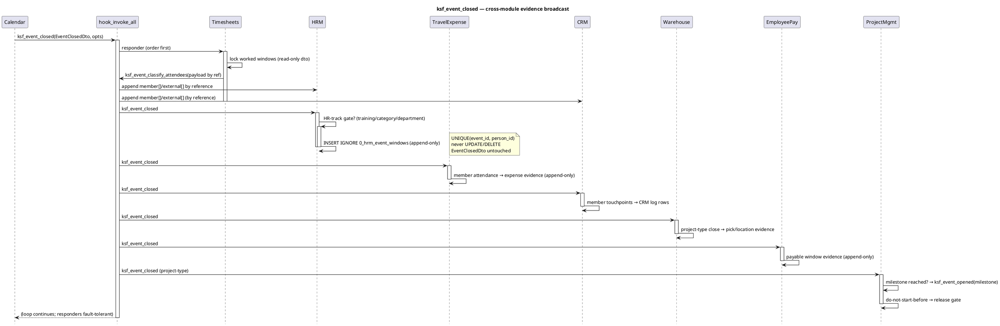

# Event-Close Message Flow — Cross-Module UML

> Canonical copy lives in `ksf_FA_Calendar`. This file is **hardlinked** into
> every participating module (one shared inode, like `AGENTS_ARCH.md`), so the
> diagram and flow tables below are identical in all affected module trees.

## Purpose

Single source of truth for how data travels **when a calendar entry is
closed**, across every module that listens to the FA event-bus (`hook_invoke_all`).
Answers the question: *"the event is closed — what evidence does each module
record, and in what order, without anyone touching the EventClosedDto?"*

## Participants / lifelines

| # | Participant | Role | Repo |
|---|-------------|------|------|
| A | `ksf_FA_Calendar` | **Emitter** — owns `ksf_event_closed` + `ksf_event_classify_attendees`; publishes `EventClosedDto` | `ksf_FA_Calendar` |
| B | `hook_invoke_all` | **Broker** — FA's cross-module broadcast loop (`includes/hooks.inc`) | FA core |
| C | `ksf_FA_Timesheets` | **Aggregator** — locks worked windows; caller of `ksf_event_classify_attendees` | `ksf_FA_Timesheets` |
| D | `ksf_FA_HRM` | **Responder** — employee/external membership + append-only worked-window evidence | `ksf_FA_HRM` |
| E | `ksf_FA_TravelExpense` | **Responder** — expense-report evidence on member attendance | `ksf_FA_TravelExpense` |
| F | `ksf_FA_CRM` | **Responder** — contact/opportunity touchpoints for attendees | `ksf_FA_CRM` |
| G | `ksf_FA_Warehouse` | **Responder** — pick/location evidence for project-type closes | `ksf_FA_Warehouse` |
| H | `ksf_FA_EmployeePay` | **Responder** — payable-window evidence for worked events | `ksf_FA_EmployeePay` |
| I | `ksf_FA_ProjectManagement` | **Responder** — milestone/do-not-start-before gating on project-type events | `ksf_FA_ProjectManagement` |

## Sequence diagram (text form — PlantUML-compatible)

## Message-flow tables

### MTX-1 — `ksf_event_closed` broadcast on entry close

| # | From | To | Call / intent | Mutates DTO? |
|---|------|----|---------------|--------------|
| 1 | Calendar | `hook_invoke_all` | `ksf_event_closed($dto, ['event_id'=>..])` | no |
| 2 | Timesheets | self | lock worked-window aggregation (read-only dto) | no |
| 3 | Timesheets | `hook_invoke_all` | `ksf_event_classify_attendees` (payload **by ref**) | no (contract) |
| 4 | HRM | self | classify attendee emails → append `member`/`external` **by reference** | no |
| 5 | CRM | self | append `member`/`external` by reference (if not already) | no |
| 6 | HRM | own table | `INSERT IGNORE 0_hrm_event_windows` per member | no |
| 7 | TravelExpense | own evidence | append expense-report rows for members | no |
| 8 | CRM | own rows | contact touchpoint log rows | no |
| 9 | Warehouse | own evidence | pick/location window evidence | no |
| 10 | EmployeePay | own evidence | payable window evidence (append-only) | no |
| 11 | ProjectMgmt | own state | milestone / do-not-start-before gate update | no |

### MTX-2 — project-type branching (the "it depends on the event type" path)

When `event_type` or `linked_entities[].entity_type` is a project token
(`project`, `milestone`, `phase`, …), responders fan out differently:

| Project sub-type | Activated follow-up | Event fired | Consumer |
|------------------|--------------------|-------------|----------|
| milestone | milestone created/updated | `ksf_event_opened` (new dto) | PM, Timesheets |
| do-not-start-before | release gate on later event | `ksf_event_closed` (gate release) | PM, Warehouse |
| training / category / department | **HR-track** | `ksf_event_classify_attendees` + windows | HRM, Pay |
| expense-bearing | expense evidence | `ksf_event_closed` | TravelExpense, EmployeePay |
| (plain) | generic close | `ksf_event_closed` | all responders (no-op where gate misses) |

## Cross-module contract invariants (same as AGENTS_ARCH.md)

1. `EventClosedDto` is **read-only everywhere** — no responder ever writes it.
2. `ksf_event_classify_attendees` classification payload arrives **by
   reference**; responders **append** into
   `$data['classification']['member'|'external']`, never `unclassified`-guess
   (AZZ — an email with no person row stays unclassified).
3. Evidence rows are **append-only** in the module's OWN table
   (`INSERT IGNORE` + `UNIQUE(event_id, person_id)`); never UPDATE/DELETE; never
   mutate the DTO.
4. All responders wrap the repository in `try/catch(\Throwable)` and return
   quietly on failure — the caller's `hook_invoke_all` loop keeps going; a
   responder never throws out.
5. HR-track gate tokens: `training`, `category`, `department` (case-insensitive
   on `event_type` **or** any linked entity type).

*Document Version: 1.0.0 — owner `ksf_FA_Calendar`; hardlinked across all
participating modules per the shared-docs convention in AGENTS.md.*
